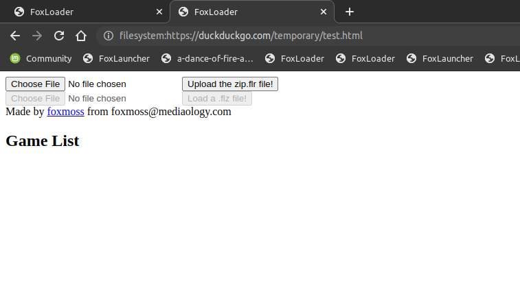
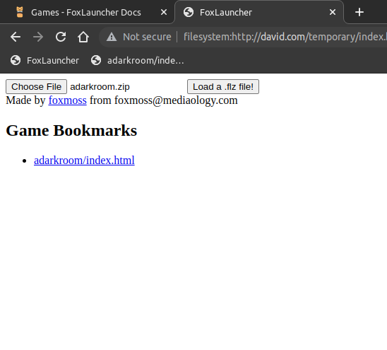

# FoxLauncher

A completly local games launcher.

FoxLauncher is superior to other methods of playing games off your chromebook the net for various reasons:

- It works with 90% of your unblocked games library with no tinkering from the devs.
- Doesn't require bookmarklets.
- Dosnt require an install games, nor to install the launcher.
- Can use elevated chrome permisons.

## Install

### 1. Install Launcher

Theres a couple ways to inject the entry point into a page, due to the only requirement being ACE.

#### Bookmark
To install FoxLauncher via bookmarks.

1. First drag the <a href="javascript:{payload}">FoxLauncher</a> bookmark into your browser's bookmark bar.
2. Go to **any** website you can access at school, this does not include the new tab page.
3. Copy and paste the url it give you into a new tab.
4. Bookmark this new page then, install the resources to finish setup!

TODO: add more entry point

### 2. Install Resources

You're almost ready to install games. Grab [zip.flr](assets/res/zip.flr) off our servers so you upload it on the FoxLauncher page.

Upload it the file, and it should give you a prompt to reload the page.

Reload the page after click "ok" with the button at the top of the page or via `ctrl-r`.

Once the page loads move onto the next step!

### 3. Install games

Now theres no more shanigians! Just games for here. Download any `.flz` from [games](games.md) and load them up through the launcher.

Then they should pop-up in the game list section!

You can then bookmark the game link, then click said bookmark to play the game!

## Credit

FoxLauncher is made by FoxMoss, with no other contributors. 

Support the project by donating to my [paypal](https://www.paypal.com/donate/?hosted_button_id=DBWDWVZF7JFEC). 

If your a student, a teacher, or a system admin wanting to block FoxLauncher ;) shoot me an email at [foxmoss@mediaology.com](mailto:foxmoss@mediaology.com).
Or find other ways to conact me at [foxmoss.com/personal/](https://foxmoss.com/personal/).