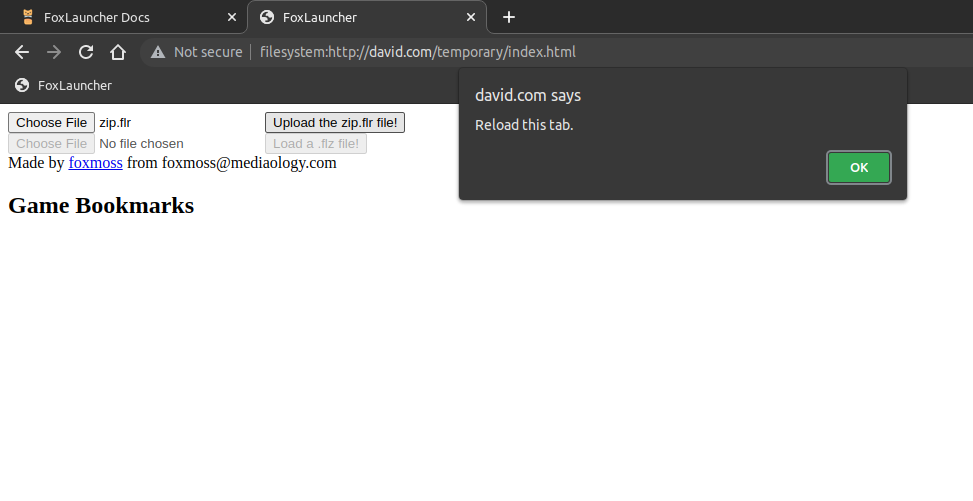

# FoxLauncher

A completely local games launcher.


FoxLauncher is superior to other methods of playing games off your chromebook the net for various reasons:

- It works with 90% of your unblocked games library with no tinkering from the developers.
- Doesn't require bookmarklets.
- Doesn't require an install games, nor to install the launcher.
- Can use elevated Chrome permissions.


NOTE: The design and style of FoxLauncher is being rapidly prototyped, screenshots may look different to the actual product, functionality should stay the same.

## Install

### 1. Install Launcher

There are a couple of ways to inject the entry point into a page, due to the only requirement being ACE.

#### Bookmark
To install FoxLauncher via bookmarks.

1. First drag the <a href="javascript:{payload}">FoxLauncher</a> bookmark into your browser's bookmark bar.
2. Go to **any** website you can access at school, this does not include the new tab page.
3. Copy and paste the URL it gives you into a new tab.
4. Bookmark this new page then, install the resources to finish setup!

5. #### Custom Webpage
To install FoxLauncher via a custom webpage (requires `githubusercontent.com` to be unblocked)

1. First go to Glitch (https://glitch.com) and sign up.
2. Go to the dashboard (https://glitch.com/dashboard) and press the "New project" button on the top right. Choose `glitch-hello-website`.
3. There is a menu of files at the left, and there will be a file named `index.html`, click it.
4. Press `CTRL + A` and delete everything.
5. Paste in this:
```html
<script>
  async function makeFile(t,a,e,i){return await new Promise(e=>{t.root.getFile(a,{},t=>{t.remove(e)},e)}),await new Promise(o=>{t.root.getFile(a,{create:!0},t=>{t.createWriter(a=>{a.write(new Blob([i],{type:e})),o(t.toURL())})})})}async function onInitFs(t){let a=await fetch("https://raw.githubusercontent.com/FoxMoss/FoxLauncher/main/payload.html"),e=await a.text(),i=await makeFile(t,"index.html","text/html",e),o=await fetch("https://raw.githubusercontent.com/FoxMoss/FoxLauncher/main/payload.js"),n=await o.text();await makeFile(t,"payload.js","text/js",n);let s=await fetch("https://raw.githubusercontent.com/FoxMoss/FoxLauncher/main/payload.css"),r=await s.text();await makeFile(t,"payload.css","text/css",r),prompt("Your finished persistence URL:",i)}webkitRequestFileSystem(window.TEMPORARY,1048576,onInitFs);
</script>
```
6. Press preview -> Preview in a new window
7. Copy and paste the URL it gives you into a new tab.
8. Bookmark this new page then, install the resources to finish setup!

TODO: add more entry points

### 2. Install Resources


You're almost ready to install games. Grab [zip.flr](assets/res/zip.flr) off our servers so you upload it on the FoxLauncher page.

Upload it the file, and it should give you a prompt to reload the page.




Reload the page after click "ok" with the button at the top of the page or via `ctrl-r`.

Once the page loads move onto the next step!

### 3. Install games

Now theres no more shenanigans! Just games for here. Download any `.flz` from [games](games.md) and load them up through the launcher.

Then they should pop-up in the game list section!


You can then bookmark the game link, then click said bookmark to play the game!

## Credit

FoxLauncher is made by FoxMoss, with no other contributors. 

Support the project by donating to my [paypal](https://www.paypal.com/donate/?hosted_button_id=DBWDWVZF7JFEC). 

If your a student, a teacher, or a system admin wanting to block FoxLauncher shoot me an email at [foxmoss@mediaology.com](mailto:foxmoss@mediaology.com).
Or find other ways to conact me at [foxmoss.com/personal/](https://foxmoss.com/personal/).
